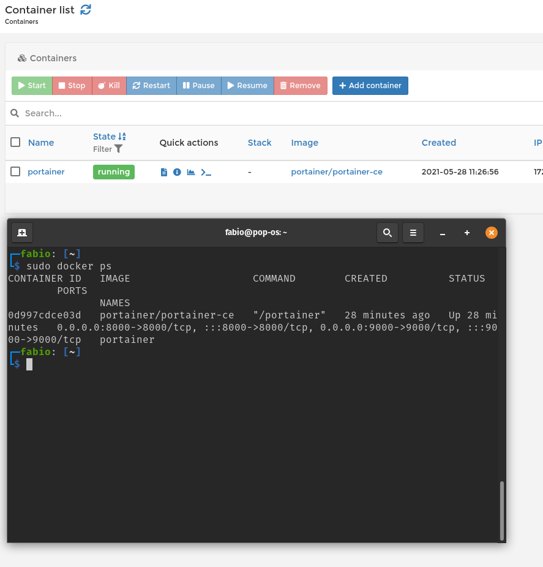

# Labo-HTTPInfra
Repo for the HTTPInfra lab from the RES course at HEIG-VD

## Part 1

For this step we will build a Docker image, run a Docker container and access its content froma browser

### Demo

To build and run the docker image for part one you need to go in the `docker-images\apache-php-image` folder and run the commands:

        docker build -t res/apache_php .
        docker run -d -p 8080:80 res/apache_php
        
You will then be able to see your website at the address `localhost:8080`.

### Configuration

In our configuration the virtual host listens on the 80 port that will be forwarded to the port 8080 thanks to Docker.

The html content will be found in the `/var/www/html` folder.

#### Config files

You can get to the config files of the running image by running the command `docker exec -it YOU_CONTAINER_NAME /bin/bash`.

To find you container name you can use the `docker ps` command. 

Then navigate to the folder containing the config files using `cd /etc/apache2/`.

#### Dockerfile

In the Dockerfile we will first create the image based on the `php:7.2-apache` image and then copy the files for the host folder `/content` to the container folder `/var/www/html/`.

## Part 2

For this step we will do the same as in step 1 but the content will be dynamically generated.

### Demo

To build and run the docker image for part one yon need to go in the `docker-images\express-image` folder and run the commands:

        docker build -t res/express_students .
        docker run -d -p 8080:3000 res/express_students
        
You will then be able to see the content randomly generated by the node.js script at the address `localhost:8080`.

### Configuration

In our configuration the virtual host listens on the 3000 port that will be forwarded to the port 8080 thanks to Docker.

The html content will be found in the `/opt/app` folder.

#### Dockerfile

In the Dockerfile we will first create the image based on the `node:14.17` image and then copy the files for the host folder `/src` to the container folder `/opt/app`. It will then run the script located at `/opt/app/index.js` using node

## Part 3

For this step we will create a reverse proxy container that will take care of the redirection towards the two other containers.

### Demo

First thing to do is to start the two previous containers:  
1. `docker run -d --name apache_static res/apache_php`
1. `docker run -d --name express_dynamic res/express_students`

Next step is to get their ip address:
1. `docker inspect apache_php | grep -i ipaddres`
1. `docker inspect express_dynamic | grep -i ipaddres`

Once you've got the two ip addresses we need to update the file `conf/sites-available/001-reverse-proxy.conf` with the ip addresses from the previous step.

Now we can build and run the reverse proxy container:
1. `docker build -t res/apache_rp .`
1. `docker run -d -p 8080:80 res/apache_rp`

To test the routing the following steps need to work:  
1. accessing via `http://localhost:8080` should not work with a 403 error
1. accessing via `http://localhost:8080` and specifying the header host = demo.res.ch (or by adding the line `localhost demo.res.ch` inside hosts file and accessing through `http://demo.res.ch:8080`) should show a web page from static container
1. accessing via `http://localhost:8080/api/students/` with host=demo.res.ch should show a page with json data from dynamic container

### Configuration

#### Dockerfile
In the Dockerfile we will first create the image based on the `php:7.2-apache` image and then copy the files for the host folder `./conf` to the container folder `/etc/apache2`.

Next step is to enable the apache modules that allow reverse proxy `proxy` and `proxy_http`

After that we enable the sites from the conf directory

#### conf folder

The necessary configuration for the reverse proxy is contained in the `conf` folder. The `001-reverse-proxy.conf` file allows for the redirection towards the static and dynamic containers with `demo.res.ch` used as the host.

### Why static configuration is fragile
The ip addresses from containers are dynamicaly assigned. It means that it will possibly not work at the next time we run all the containers as they may have changed their ip addresses.

### Why servers cannot be reached directly
First of all that's only true for non Linux OS. On Linux we can access each container without port mapping via their ip addres `ping <container_ip>` will work.

For other OS than Linux docker creates a Linux vm to run the containers which makes them unreachable from outside the vm we can still access them by doing a port mapping. You can simply `ping <container_ip>` and it will not work.

## Part 4

For this part we will use JQuery to make an AJAX request.

### Demo
As we have made change on the website files we need to rebuild the image `res/apache_php`.
Launch all containers like in [Part 3](#part-3) and access `http://demo.res.ch:8080` on your browser. Now you should see message from aliens that are auto updated each 10 seconds.

### Prove that request are send by the browser
Here we can see all the request send by the browser to our api:

On the left side we can see the requests and on the right side we see the response from the selected request.

### Why it would not work without reverse proxy
If we were not using a reverse proxy the browser would block any request that tries to access data from a different top level domain (anything that comes from another domain than res.ch) due to the cross origin policy.

### Configuration
For this step we only changed content files.

## Part 5

For this step we will make our reverse proxy configuration dynamic

### Demo
On Linux execute the script `run_everything.sh`.

On windows execute the following commands:
- run static `docker run -d --name apache_static res/apache_php`
- run dynamic `docker run -d --name express_dynamic res/express_students`
- get ip from static `docker inspect -f '{{range .NetworkSettings.Networks}}{{.IPAddress}}{{end}}' apache_static`
- get ip from dynamic `docker inspect -f '{{range .NetworkSettings.Networks}}{{.IPAddress}}{{end}}' express_dynamic`
- run reverse proxy replace with the ip from previous steps `docker run -d -e STATIC_APP=<ip_static> -e DYNAMIC_APP=<ip_dynamic>:3000 -p 8080:80 res/apache_rp`

### Configuration

#### Dockerfile
Same as on [Part 3](#part-3) we just removed de enable site of `001-reverse-proxy.conf` because it will be auto generated by the php script.
We also copy the files `apache2-foreground` and `config-template.php`

#### apache2-foreground
This file is executed by the php:7.2-apache image so we added code here to execute a php script `config-template.php` and enable de site `001-reverse-proxy.conf`

### config-template.php
This is a php script that creates the file `001-reverse-proxy.conf` containing the values from environment variables.

## Load balancing: multiple server nodes

For this step we extended the reverse proxy configuration to support load balancing.

### Demo

A new docker image has been created for this step the `apache-php-image2` image. This image is a simple copy of the `apache-php-image` image with some static data changing to be able to diffrerenciate between the 2 possible containers that can be used by the load balancer.

First thing to do is to build the new docker image by running the `docker build -t res/apache_php2 .` command in the new docker image folder.

After that you need to run 2 express_students containers and the apache_php and apache_php2 containers:

        docker run -d --name apache_static res/apache_php
        docker run -d --name apache_static2 res/apache_php2
        docker run -d --name express_dynamic res/express_students
        docker run -d --name express_dynamic2 res/express_students2
        
The next step is to get the ip adresses of each of the containers:

        docker inspect -f '{{range.NetworkSettings.Networks}}{{.IPAddress}}{{end}}' apache_static
        docker inspect -f '{{range.NetworkSettings.Networks}}{{.IPAddress}}{{end}}' apache_static2
        docker inspect -f '{{range.NetworkSettings.Networks}}{{.IPAddress}}{{end}}' express_dynamic
        docker inspect -f '{{range.NetworkSettings.Networks}}{{.IPAddress}}{{end}}' express_dynamic2
       
Finally you need to run the reverse proxy container with the correct variables. Be careful to replace the ip adresses below with the ones you got with the above command:

```
docker run -d -e STATIC_APP_1=172.17.0.2:80 -e STATIC_APP_2=172.17.0.3:80 -e DYNAMIC_APP_1=172.17.0.4:3000 -e DYNAMIC_APP_2=172.17.0.5:3000 -p 8080:80 --name apache-rp res/apache_rp
```

Now just connect to the http://demo.res.ch:8080 adress via you browser and you will be able to see our website. If you refresh a few times the page (without the cache) you will be able to see the load balancer switching between the 2 static containers and if you take a look at the logs of the dynamic containers you will be able to see that both are used.

### Configuration

#### config-template.php

For this part we had to modify the `config-template.php` file of the `apache-reverse-proxy` folder:

        <VirtualHost *:80>
            ServerName demo.res.ch

            #ErrorLog ${APACHE_LOG_DIR}/error.log
            #CustomLog ${APACHE_LOG_DIR}/access.log combined


            <Proxy balancer://dynamic_app>
                BalancerMember 'http://<?=getenv('DYNAMIC_APP_1')?>'
                BalancerMember 'http://<?=getenv('DYNAMIC_APP_2')?>'
            </Proxy>

            <Proxy balancer://static_app>
                BalancerMember 'http://<?=getenv('STATIC_APP_1')?>'
                BalancerMember 'http://<?=getenv('STATIC_APP_2')?>'
            </Proxy>

            ProxyPass "/api/students" "balancer://dynamic_app/"
            ProxyPassReverse "/api/students" "balancer://dynamic_app/"

            ProxyPass "/" "balancer://static_app/"
            ProxyPassReverse "/" "balancer://static_app/"
        </VirtualHost>
        
We added the balancers and modified the environement variables.

#### Dockerfile
We had to modify the of the `apache-reverse-proxy` folder's Dockerfile.

To be able to use the balancer we had to add the `proxy_balancer` and `lbmethod_byrequests` modules to the `RUN a2enmod command`

### Validation procedure

To validate this step we used to technique described in the demo by using 2 different container for the static part and change some of the static data to be able to see which one is used : 


## Load balancing: round-robin vs sticky sessions

For this step we improved the load balancing by implementing sticky sessions

### Demo

For this step the manipulations are the same as in the previous step

When you'll connect to the website you'll see that even when refreshing (without the cache) you'll use the same static container. This is caused by the sticky session. If you use an other browser you will use the other container and continue using it. The dynamic containers are both used by both the browsers as they still work in round-robin.

### Configuration

#### config-template.php

For this part we had to modify the `config-template.php` file of the `apache-reverse-proxy` folder:

       <VirtualHost *:80>
            ServerName demo.res.ch

            #ErrorLog ${APACHE_LOG_DIR}/error.log
            #CustomLog ${APACHE_LOG_DIR}/access.log combined

                Header add Set-Cookie "ROUTEID=.%{BALANCER_WORKER_ROUTE}e; path=/" env=BALANCER_ROUTE_CHANGED

            <Proxy balancer://dynamic_app>
                BalancerMember 'http://<?=getenv('DYNAMIC_APP_1')?>'
                BalancerMember 'http://<?=getenv('DYNAMIC_APP_2')?>'
            </Proxy>

            <Proxy balancer://static_app>
                BalancerMember 'http://<?=getenv('STATIC_APP_1')?>' route=1
                BalancerMember 'http://<?=getenv('STATIC_APP_2')?>' route=2
                        ProxySet lbmethod=byrequests
                ProxySet stickysession=ROUTEID
            </Proxy>

            ProxyPass "/api/students" "balancer://dynamic_app/"
            ProxyPassReverse "/api/students" "balancer://dynamic_app/"

            ProxyPass "/" "balancer://static_app/"
            ProxyPassReverse "/" "balancer://static_app/"
        </VirtualHost>
        
We added a header for the cookies and enbled the sticky sessions for the static_app balancer by using the `ProxySet stickysession=ROUTE` and adding ids to the two static apps.

#### Dockerfile

To be able to use the cookie headers we had to add the `headers` module to the `RUN a2enmod command`

### Validation procedure

To validate this step we used to technique described in the demo by using 2 different container for the static part and change some of the static data to be able to see which one is used.

## Dynamic cluster management 

For this step we used a cluster manager that can update dynamically the server nodes

### Demo

For this step the manipulations are the same as in the previous step.

When you'll connect to the website everything will work as in the previous step. By connecting to the `http://demo.res.ch:8080/balancer-manager` adress you will be able to access the cluster manager page. 

To test this tool you can open the static node your website is using (1.) and activate the "stopped" option (2.). 


Now if you refresh the main website you will see that you are using the other static node despite the sticky session. That is because you dynamically stopped the one you were using previously.

### Configuration

#### config-template.php

For this part we had to modify the `config-template.php` file of the `apache-reverse-proxy` folder:

     <VirtualHost *:80>
            ServerName demo.res.ch

            #ErrorLog ${APACHE_LOG_DIR}/error.log
            #CustomLog ${APACHE_LOG_DIR}/access.log combined

                Header add Set-Cookie "ROUTEID=.%{BALANCER_WORKER_ROUTE}e; path=/" env=BALANCER_ROUTE_CHANGED

            <Proxy balancer://dynamic_app>
                BalancerMember 'http://<?=getenv('DYNAMIC_APP_1')?>'
                BalancerMember 'http://<?=getenv('DYNAMIC_APP_2')?>'
            </Proxy>

            <Proxy balancer://static_app>
                BalancerMember 'http://<?=getenv('STATIC_APP_1')?>' route=1
                BalancerMember 'http://<?=getenv('STATIC_APP_2')?>' route=2
                        ProxySet lbmethod=byrequests
                ProxySet stickysession=ROUTEID
            </Proxy>

                <Location "/balancer-manager">
                        SetHandler balancer-manager
                </Location>
                ProxyPass /balancer-manager !

            ProxyPass "/api/students" "balancer://dynamic_app/"
            ProxyPassReverse "/api/students" "balancer://dynamic_app/"

            ProxyPass "/" "balancer://static_app/"
            ProxyPassReverse "/" "balancer://static_app/"
        </VirtualHost>
        
We added these lines of code to enable the interface :

        <Location "/balancer-manager/">
            SetHandler balancer-manager
        </Location>
        ProxyPass '/balancer-manager/' !

### Validation procedure

To validate this step we used the technique described in the demo. With this we can see that we can disable one of the clusters. 

Furthermore if we disable the two static nodes the website becomes inavailable.


 And if we disable the two dynamic ones the website can't fetch the alien messages.


## Management UI

For this step we decided to chose a web app named `portainer.io` that makes possible to manage docker through the web browser.

### How to install
Linux:
```bash
docker volume create portainer_data

docker run -d -p 8000:8000 -p 9000:9000 --name=portainer --restart=always -v /var/run/docker.sock:/var/run/docker.sock -v portainer_data:/data portainer/portainer-ce
```

Windows:
Before to deply on windows you need to install WSL [more info](https://docs.microsoft.com/en-us/windows/wsl/install-win10)

```
docker volume create portainer_data

docker run -d -p 8000:8000 -p 9000:9000 --name=portainer --restart=always -v /var/run/docker.sock:/var/run/docker.sock -v portainer_data:/data portainer/portainer-ce
```

Once the container running you can access the web app [http://localhost:9000](http://localhost:9000) and create a user

### Validation procedure
Below we can see the initial state of all containers on portainer and docker ps.


Now by clicking on Add container we have a new page where we can add a new container.


After filling the name the image and set autoremove to true we can see that our container as been added to the list, we can also find im with a docker ps


Containers added from the terminal are also added to the portainer container list


If we stop a container that as not the flag auto remove it will show as stopped and can be restarted.


If we stop a container that as the flag auto remove it will be removed when stopped. Ex with apache_static:

